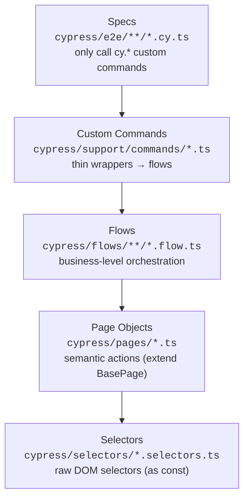

# Cypress E2E Automation — Automation Test Store

[](https://github.com/Zaru92/cypress_automationteststore/actions/workflows/cypress-e2e.yml)
[](https://github.com/Zaru92/cypress_automationteststore/actions/workflows/quality-check.yml)
[](https://www.cypress.io/)
[](https://www.typescriptlang.org/)

A TypeScript end-to-end test suite for the public demo shop
[automationteststore.com](https://automationteststore.com), built as a portfolio
project to demonstrate maintainable, layered Cypress automation with CI and reporting.

**📊 [Live Allure test report](https://zaru92.github.io/cypress_automationteststore/)** — published automatically by CI on every push to `main`.


## What's covered

| Layer      | Area           | Specs                                               |
| ---------- | -------------- | --------------------------------------------------- |
| **UI**     | Auth           | valid login, negative login, user registration      |
| **UI**     | Cart           | add to cart, cart summary, delete from cart         |
| **UI**     | Checkout       | confirm checkout, empty-cart guard                  |
| **UI**     | Products       | product details, product search                     |
| **UI**     | Navigation     | header navigation, home-page healthcheck            |
| **API**    | Direct API     | cart & product endpoints, positive + negative cases |
| **Mocked** | `cy.intercept` | empty search results, server-error (5xx) handling   |

## Tech stack

- **[Cypress](https://www.cypress.io/) 15** + **[TypeScript](https://www.typescriptlang.org/) 5** (`strict`)
- **[Allure](https://allurereport.org/)** reporting (`allure-cypress`)
- **[@cypress/grep](https://github.com/cypress-io/cypress/tree/develop/npm/grep)** for tag-based test selection (`@smoke`, `@regression`, `@ui`, `@api`, `@mocked`, `@negative`)
- **ESLint** (`typescript-eslint` type-checked) + **Prettier** + **Husky** (pre-commit `lint-staged`)
- **GitHub Actions** CI (smoke on PR, cross-browser matrix on push, manual dispatch)

## Architecture

Tests are built as a strict 4-layer stack. Each layer talks **only** to the layer
directly below it — specs never touch raw selectors, page objects, or `cy` chains
of lower layers. This keeps selectors in one place, business intent in flows, and
specs readable.



Example slice (home page healthcheck): `homeSelectors.searchInput` →
`homePage.assertLoaded()` → `openHomePageFlow()` → `cy.openHomePage()` →
`home-page-healthcheck.cy.ts`.

## Running locally

```bash
npm install

npm run cy:open            # interactive runner
npm run cy:run             # headless, all specs
npm run cy:run:chrome      # headless in Chrome
npm run cy:run:firefox     # headless in Firefox

# Run by tag
npm run test:smoke
npm run test:regression
npm run test:api
npm run test:mocked

# Allure report (local)
npm run test:allure:open   # run + generate + open report

# Quality gate (run before pushing)
npm run quality:check      # typecheck + lint + format:check
```

Specs target the live site via `baseUrl` in `cypress.config.ts` (1440×900 viewport,
generous timeouts, 1 retry in CI).

## Continuous Integration

Two GitHub Actions workflows run on every pull request and push to `main`:

- **Quality Check** — `tsc --noEmit`, ESLint, and Prettier format check.
- **Cypress E2E Tests**
  - **Pull request:** `@smoke` suite.
  - **Push to `main`:** cross-browser **regression** matrix — Chrome, Firefox, Electron.
  - **Manual (`workflow_dispatch`):** pick a test group (smoke / regression / api / mocked / negative / full).
  - **Report publish:** generates the Allure report and deploys it to GitHub Pages
    (the live report linked above).

Cypress screenshots, videos, and Allure artifacts are uploaded on every run.
