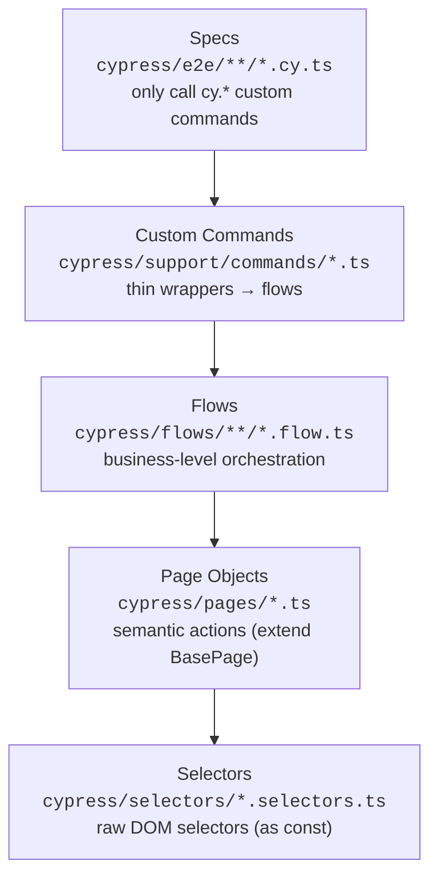

# Portfolio Polish Implementation Plan

> **For agentic workers:** REQUIRED SUB-SKILL: Use superpowers:subagent-driven-development (recommended) or superpowers:executing-plans to implement this plan task-by-task. Steps use checkbox (`- [ ]`) syntax for tracking.

**Goal:** Make the existing mature Cypress suite legible to a skimming mid-level QA recruiter via a real README, CI badges, a screenshot, and a publicly hosted Allure report.

**Architecture:** Pure presentation/visibility pass — no test code changes. Rewrite `README.md` (Markdown + native GitHub Mermaid diagram + Actions badges), add a screenshot asset, and add a `publish-report` job to `cypress-e2e.yml` that deploys the generated Allure report to the `gh-pages` branch (served by GitHub Pages).

**Tech Stack:** Markdown, Mermaid (GitHub-native), GitHub Actions, `peaceiris/actions-gh-pages`, existing Allure tooling (`allure-cypress`, `report:generate`).

**Note on TDD:** This plan produces docs and CI config, not application code, so there is no unit-test harness. Each task's "verification" is a concrete command (Prettier formatting, YAML parse, link/badge resolution) or a documented manual check. Honor the spirit: change → verify → commit.

**Repo facts (do not re-derive):**

- Owner/repo: `Zaru92/cypress_automationteststore`
- Pages URL (post-deploy): `https://zaru92.github.io/cypress_automationteststore/`
- Workflows: `.github/workflows/cypress-e2e.yml`, `.github/workflows/quality-check.yml`
- Versions: Cypress ^15.15.0, TypeScript ^5.9.3, allure-cypress ^3.9.0, @cypress/grep ^6.0.0, ESLint ^10.4.0, Prettier 3.8.3, Husky ^9.1.7
- Working branch: `feature/portfolio-polish` (already created off `main`)

---

## File Structure

- **Create** `README.md` content (file exists with one line; fully replace it) — the recruiter-facing centerpiece.
- **Create** `docs/assets/allure-dashboard.png` — embedded screenshot.
- **Modify** `.github/workflows/cypress-e2e.yml` — add `publish-report` job (push-to-`main` only).
- Spec already committed at `docs/superpowers/specs/2026-06-02-portfolio-polish-design.md` (no change).

---

## Task 1: Rewrite README.md

**Files:**

- Modify (full replace): `README.md`

- [ ] **Step 1: Replace README.md with the full content below**

Write this exact content to `README.md` (it references `docs/assets/allure-dashboard.png`, added in Task 2, and the Pages URL, which goes live in Task 3 — referencing them now is intentional):

````markdown
# Cypress E2E Automation — Automation Test Store

[](https://github.com/Zaru92/cypress_automationteststore/actions/workflows/cypress-e2e.yml)
[](https://github.com/Zaru92/cypress_automationteststore/actions/workflows/quality-check.yml)
[](https://www.cypress.io/)
[](https://www.typescriptlang.org/)

A TypeScript end-to-end test suite for the public demo shop
[automationteststore.com](https://automationteststore.com), built as a portfolio
project to demonstrate maintainable, layered Cypress automation with CI and reporting.

**📊 [Live Allure test report](https://zaru92.github.io/cypress_automationteststore/)** — published automatically by CI on every push to `main`.


## What's covered

| Layer      | Area           | Specs                                               |
| ---------- | -------------- | --------------------------------------------------- |
| **UI**     | Auth           | valid login, negative login, user registration      |
| **UI**     | Cart           | add to cart, cart summary, delete from cart         |
| **UI**     | Checkout       | confirm checkout, empty-cart guard                  |
| **UI**     | Products       | product details, product search                     |
| **UI**     | Navigation     | header navigation, home-page healthcheck            |
| **API**    | Direct API     | cart & product endpoints, positive + negative cases |
| **Mocked** | `cy.intercept` | empty search results, server-error (5xx) handling   |

## Tech stack

- **[Cypress](https://www.cypress.io/) 15** + **[TypeScript](https://www.typescriptlang.org/) 5** (`strict`)
- **[Allure](https://allurereport.org/)** reporting (`allure-cypress`)
- **[@cypress/grep](https://github.com/cypress-io/cypress/tree/develop/npm/grep)** for tag-based test selection (`@smoke`, `@regression`, `@ui`, `@api`, `@mocked`, `@negative`)
- **ESLint** (`typescript-eslint` type-checked) + **Prettier** + **Husky** (pre-commit `lint-staged`)
- **GitHub Actions** CI (smoke on PR, cross-browser matrix on push, manual dispatch)

## Architecture

Tests are built as a strict 4-layer stack. Each layer talks **only** to the layer
directly below it — specs never touch raw selectors, page objects, or `cy` chains
of lower layers. This keeps selectors in one place, business intent in flows, and
specs readable.



Example slice (home page healthcheck): `homeSelectors.searchInput` →
`homePage.assertLoaded()` → `openHomePageFlow()` → `cy.openHomePage()` →
`home-page-healthcheck.cy.ts`.

## Running locally

```bash
npm install

npm run cy:open            # interactive runner
npm run cy:run             # headless, all specs
npm run cy:run:chrome      # headless in Chrome
npm run cy:run:firefox     # headless in Firefox

# Run by tag
npm run test:smoke
npm run test:regression
npm run test:api
npm run test:mocked

# Allure report (local)
npm run test:allure:open   # run + generate + open report

# Quality gate (run before pushing)
npm run quality:check      # typecheck + lint + format:check
```

Specs target the live site via `baseUrl` in `cypress.config.ts` (1440×900 viewport,
generous timeouts, 1 retry in CI).

## Continuous Integration

Two GitHub Actions workflows run on every pull request and push to `main`:

- **Quality Check** — `tsc --noEmit`, ESLint, and Prettier format check.
- **Cypress E2E Tests**
  - **Pull request:** `@smoke` suite.
  - **Push to `main`:** cross-browser **regression** matrix — Chrome, Firefox, Electron.
  - **Manual (`workflow_dispatch`):** pick a test group (smoke / regression / api / mocked / negative / full).
  - **Report publish:** generates the Allure report and deploys it to GitHub Pages
    (the live report linked above).

Cypress screenshots, videos, and Allure artifacts are uploaded on every run.
````

- [ ] **Step 2: Verify Prettier accepts the formatting**

Run: `npm run format:check`
Expected: PASS (no formatting complaints about `README.md`). If it reports `README.md`, run `npm run format` and re-check.

- [ ] **Step 3: Verify Markdown structure renders**

Run: `npx --yes markdown-link-check --help >/dev/null 2>&1 && echo tool-ok || echo "skip link-check (offline ok)"`
Then manually confirm in a GitHub Markdown preview (or VS Code preview) that: badges appear, the Mermaid block renders as a diagram, and the table is well-formed.
Expected: diagram renders, no broken table.

Note: the badge images will show "no status" and the report link will 404 **until Task 3 runs and the first push to `main` happens** — that is expected at this stage.

- [ ] **Step 4: Commit**

```bash
git add README.md
git commit -m "Add recruiter-facing README with badges, architecture diagram, and coverage"
```

---

## Task 2: Add Allure dashboard screenshot

**Files:**

- Create: `docs/assets/allure-dashboard.png`

This task requires running the suite locally and capturing the report UI — a manual GUI step. Per the spec the screenshot is "sufficient as a static image"; a GIF is optional and out of scope here.

- [ ] **Step 1: Generate a fresh Allure report locally**

Run: `npm run test:smoke` then `npm run report:generate`
Expected: `reports/allure-report/` is created. (Using `@smoke` keeps it fast; any green run works.)

- [ ] **Step 2: Open the report**

Run: `npm run report:open`
Expected: the Allure report opens in a browser showing the Overview dashboard (pass/fail donut, suites, trend widgets).

- [ ] **Step 3: Capture the screenshot**

Take a screenshot of the Allure **Overview** page (the dashboard with the results donut and widgets). On macOS: `Cmd+Shift+4` then drag over the report area.
Save it as: `docs/assets/allure-dashboard.png`

```bash
mkdir -p docs/assets
# move the captured file into place, e.g.:
# mv ~/Desktop/Screenshot*.png docs/assets/allure-dashboard.png
```

- [ ] **Step 4: Verify the image exists and is a PNG**

Run: `file docs/assets/allure-dashboard.png`
Expected: output contains `PNG image data`.

- [ ] **Step 5: Verify README references it correctly**

Run: `grep -n "docs/assets/allure-dashboard.png" README.md`
Expected: one match (the `` line from Task 1).

- [ ] **Step 6: Commit**

```bash
git add docs/assets/allure-dashboard.png
git commit -m "Add Allure dashboard screenshot for README"
```

---

## Task 3: Publish Allure report to GitHub Pages

**Files:**

- Modify: `.github/workflows/cypress-e2e.yml` (add a new `publish-report` job)

Add a dedicated job that runs on push to `main`, **depends on the existing
`cypress-cross-browser` matrix**, downloads all three browsers' uploaded
`allure-results`, merges them into one results directory, restores prior Allure
history (for trend graphs), generates a single combined report, and deploys it to
the `gh-pages` branch via `peaceiris/actions-gh-pages`. The job does **not**
re-run tests — re-running a single browser would duplicate the matrix work and
publish a report that hides Chrome/Firefox-specific failures, making the live
report misleading. `if: always()` ensures the report still publishes (showing the
failures) when a matrix browser fails.

- [ ] **Step 1: Append the `publish-report` job to `.github/workflows/cypress-e2e.yml`**

Add this job at the end of the `jobs:` map (sibling to `cypress-smoke`, `cypress-cross-browser`, `cypress-manual`). Preserve existing indentation (2 spaces):

```yaml
publish-report:
  name: Publish Allure report to Pages
  runs-on: ubuntu-24.04

  needs: cypress-cross-browser
  if: always() && github.event_name == 'push'

  permissions:
    contents: write

  steps:
    - name: Checkout repository
      uses: actions/checkout@v6

    - name: Setup Node.js
      uses: actions/setup-node@v6
      with:
        node-version: 24
        cache: npm

    - name: Install dependencies
      run: npm ci
      env:
        CYPRESS_INSTALL_BINARY: 0

    - name: Download regression results from all browsers
      uses: actions/download-artifact@v4
      with:
        pattern: cypress-*-artifacts
        path: downloaded-artifacts

    - name: Merge Allure results from all browsers
      run: |
        mkdir -p reports/allure-results
        find downloaded-artifacts -type d -name allure-results \
          -exec sh -c 'cp -a "$1"/. reports/allure-results/ 2>/dev/null || true' _ {} \;

    - name: Restore previous Allure history
      uses: actions/checkout@v6
      with:
        ref: gh-pages
        path: gh-pages-prev
      continue-on-error: true

    - name: Seed history into results
      run: |
        mkdir -p reports/allure-results/history
        if [ -d gh-pages-prev/history ]; then
          cp -r gh-pages-prev/history/* reports/allure-results/history/ || true
        fi

    - name: Generate Allure report
      run: npm run report:generate

    - name: Deploy report to GitHub Pages
      uses: peaceiris/actions-gh-pages@v4
      with:
        github_token: ${{ secrets.GITHUB_TOKEN }}
        publish_dir: reports/allure-report
        publish_branch: gh-pages
```

Rationale notes (do not add as comments unless matching file style): `needs:` + `if: always()` make the publish job wait for the full Chrome/Firefox/Electron matrix and run even if a browser failed, so the report reflects (not hides) failures. The merge step combines every browser's `allure-results` (result files use unique UUIDs, so no collisions). No test run here — results come from the matrix artifacts. The `setup-node` + `npm ci` steps are required: `report:generate` invokes the local `allure` binary from `node_modules/.bin`, and unlike the Cypress jobs (which install via the Cypress action) this job has no `node_modules` otherwise. `CYPRESS_INSTALL_BINARY: 0` skips the unneeded Cypress browser-binary download since this job runs no tests.

- [ ] **Step 2: Verify the YAML still parses**

Run: `ruby -ryaml -e "YAML.load_file('.github/workflows/cypress-e2e.yml'); puts 'YAML valid'"`
Expected: `YAML valid`

- [ ] **Step 3: Verify the new job is present and well-formed**

Run: `grep -n "publish-report\|peaceiris/actions-gh-pages\|publish_branch: gh-pages" .github/workflows/cypress-e2e.yml`
Expected: three matches (job key, action, publish branch).

- [ ] **Step 4: Verify the test-running jobs were not altered**

Run: `grep -c "uses: cypress-io/github-action@v7" .github/workflows/cypress-e2e.yml`
Expected: `3` (smoke, cross-browser, manual). The publish job runs no tests — it
consumes the matrix artifacts — so it must add a `needs: cypress-cross-browser`:

Run: `grep -c "needs: cypress-cross-browser" .github/workflows/cypress-e2e.yml`
Expected: `1`.

- [ ] **Step 5: Commit**

```bash
git add .github/workflows/cypress-e2e.yml
git commit -m "Publish Allure report to GitHub Pages on push to main"
```

---

## Task 4: Go live — enable Pages, push, and verify

**Files:** none (repo settings + verification)

- [ ] **Step 1: Push the branch and open a PR**

```bash
git push -u origin feature/portfolio-polish
gh pr create --base main --head feature/portfolio-polish \
  --title "Portfolio polish: README, badges, screenshot, hosted Allure report" \
  --body "Presentation pass — recruiter-facing README, CI status badges, Allure dashboard screenshot, and Allure report auto-published to GitHub Pages on push to main. No test code changed. Spec: docs/superpowers/specs/2026-06-02-portfolio-polish-design.md"
```

Expected: PR created; the **Quality Check** and **Cypress E2E (smoke)** checks start on the PR.

- [ ] **Step 2: Confirm PR checks pass**

Run: `gh pr checks --watch`
Expected: Quality Check and smoke checks succeed. Fix any Prettier/lint failures on the README if reported, then re-push.

- [ ] **Step 3: Merge the PR**

```bash
gh pr merge --squash --delete-branch
```

Expected: merged to `main`. This triggers the push workflows, including `publish-report`, which creates the `gh-pages` branch on first run.

- [ ] **Step 4: Enable GitHub Pages (one-time, after gh-pages exists)**

After the `publish-report` job completes once (creating `gh-pages`), set the Pages source:

```bash
gh api -X POST repos/Zaru92/cypress_automationteststore/pages \
  -f "source[branch]=gh-pages" -f "source[path]=/" 2>/dev/null \
  || gh api -X PUT repos/Zaru92/cypress_automationteststore/pages \
       -f "source[branch]=gh-pages" -f "source[path]=/"
```

Or via UI: **Settings → Pages → Source: Deploy from a branch → `gh-pages` / `/ (root)`**.
Expected: Pages build kicks off.

- [ ] **Step 5: Verify the live report resolves**

Run: `curl -sSI https://zaru92.github.io/cypress_automationteststore/ | head -1`
Expected: `HTTP/2 200` (allow a few minutes after enabling Pages; re-run if it 404s initially).

- [ ] **Step 6: Verify the badges now show status**

Open the repo README on GitHub and confirm the **Cypress E2E Tests** and **Quality Check** badges render with a status (green) rather than "no status".
Expected: both badges show a passing run on `main`.

---

## Self-Review

**Spec coverage:**

- Deliverable 1 (README rewrite, English, all 9 sections) → Task 1. ✓
- Deliverable 2 (CI status badges) → Task 1 badges block. ✓
- Deliverable 3 (publish Allure to Pages, stable URL, history preserved) → Task 3 + Task 4 (enable Pages, verify URL). ✓
- Deliverable 4 (screenshot embedded) → Task 2. ✓
- Out-of-scope items (no new tests, no refactor, English only) respected — no task touches `cypress/e2e`, pages, flows, or selectors. ✓
- Risk "Pages must be enabled" → Task 4 Step 4. ✓
- Risk "publish suite small (one browser)" → Task 3 uses `--browser electron`, single job. ✓

**Placeholder scan:** No TBD/TODO; README content and workflow YAML are given in full. The screenshot is an intentional manual capture with exact save path. ✓

**Consistency:** README image path `docs/assets/allure-dashboard.png` matches Task 2's save path and grep check. Pages URL identical across README, Task 3 rationale, and Task 4 verification. Job name `publish-report` consistent between Task 3 steps. ✓
